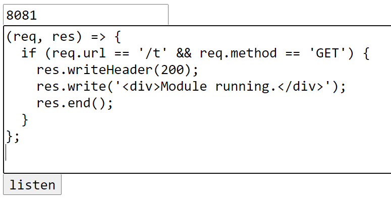

# all-purpose-web-application: An Web Application of Web Applications



## How to use

Start server in shell.

```
$ node all-purpose-web-application.js <port>
```

Example:
```
$ node all-purpose-web-application.js 8080
```

Open listen page in web browser.

Example:
```
$ http://localhost:8080/listen
```

Enter new web application's port number and handler program.

Example:
```
8081
```
```
(req, res) => {
  if (req.url == '/t' && req.method == 'GET') {
    res.writeHeader(200);
    res.write('<div>Module is running.</div>');
    res.end();
  }
};
```

Then submit.

Open the new web application's page in web browser.

Example:
```
$ http://localhost:8081/t
```

You'll see the new web application that loaded dynamically.

